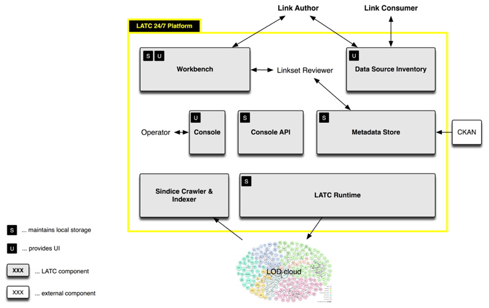

# LATC 24/7 Interlinking Platform

The [LATC](http://latc-project.eu/) 24/7 Interlinking Platform (24/7 Plaform) is a [cloud](http://en.wikipedia.org/wiki/Cloud_computing#Application) offering to generate RDF links between datasets in the [Linked Open Data](http://lod-cloud.net/) cloud.

## Contact

If you have any questions, please [contact](http://latc-project.eu/contact) us.

## License

This software provided in this repository is Open Source.